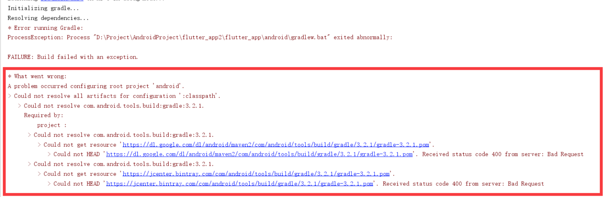

## Flutter安装遇到的问题解决

::: tip

这里只说明其中一些遇到的问题及解决办法，其他详细安装步骤请参考官方文档。

官方文档地址：[Flutter中文](https://flutter-io.cn/)，[Flutter英文](https://flutter.dev)

:::

### 1.  brew安装Ios运行环境报错问题

当我们运行flutter doctor来检测我们的开发环境是否安装好的时候，
会提示你用brew来安装一些ios的包，然后运行brew install的时候报错，
提示没有权限，运行以下shell解决：

``` shell
sudo mkdir /usr/local/Frameworks
```


### 2.  AndroidStudio镜像问题(有梯子的话，那就打扰了...)

当将flutter应用运行在安卓模拟器的时候，会卡在命令行界面，如图所示：



这是因为无法下载(墙)gradle文件导致的错误，解决办法，在grade根目录添加以下文件即可。

mac的路径为：<mark>/Users/[name]/.gradle</mark>，[name]为你mac的name

```vim
allprojects{
    repositories {
        def ALIYUN_REPOSITORY_URL = 'http://maven.aliyun.com/nexus/content/groups/public'
        def ALIYUN_JCENTER_URL = 'http://maven.aliyun.com/nexus/content/repositories/jcenter'
        all { ArtifactRepository repo ->
            if(repo instanceof MavenArtifactRepository){
                def url = repo.url.toString()
                if (url.startsWith('https://repo1.maven.org/maven2')) {
                    project.logger.lifecycle "Repository ${repo.url} replaced by $ALIYUN_REPOSITORY_URL."
                    remove repo
                }
                if (url.startsWith('https://jcenter.bintray.com/')) {
                    project.logger.lifecycle "Repository ${repo.url} replaced by $ALIYUN_JCENTER_URL."
                    remove repo
                }
            }
        }
        maven {
            url ALIYUN_REPOSITORY_URL
            url ALIYUN_JCENTER_URL
        }
    }
}
```

OK，这时候再次运行flutter run，发现还是会报上面类似的错误，里边有代理的字样，这是为啥？

其实这是因为我之前设置了代理，发现AS记录的代理地址仍然存在与AS的配置文件中，
那么我们就把他们干掉，应该就可以。

::: warning

注意，这里要在全局的和当前项目里的配置文件(**gradle.properties**)里修改，
将其中含有proxy 127.0.0.1:1087类似的语句都删掉

:::

好了，这时我们再运行flutter，就可以成功的跑起来啦！


最近一直在想做个app，可是没有好的idea，你们有什么想法吗?

<Comment/>